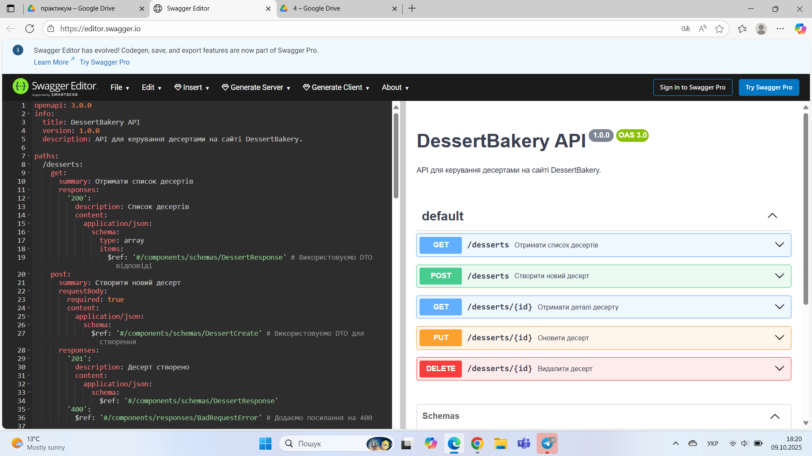

# Dessert Bakery Web App

Web app for Dessert Bakery with Node.js and MySQL

Коротко: веб-додаток.

## Як запустити локально

1. Скопіювати `.env.example` -> `.env` та заповнити змінні:
   - DB_HOST
   - DB_USER
   - DB_PASS
   - DB_NAME
   - PORT

2. Встановити залежності:

```bash
npm install

mysql -u root -p
CREATE DATABASE DessertBakery;

node server.js
# або
npm start


## API документація

[Специфікація OpenAPI (YAML)](docs/api/openapi.yaml)


